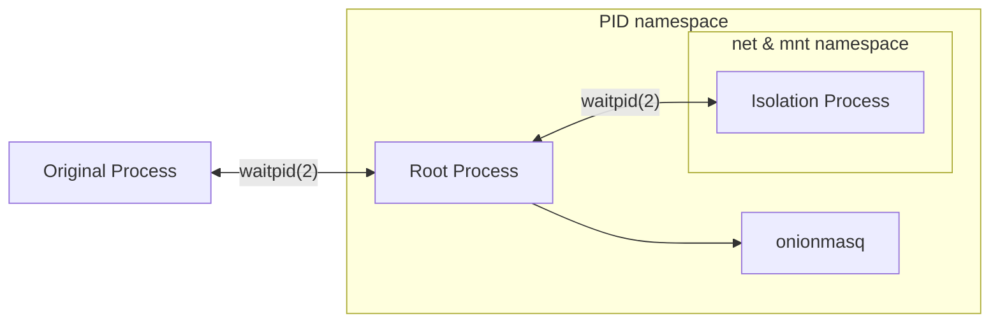

# oniux

*oniux* is a tool that utilizes various Linux `namespaces(7)` in order to isolate
an arbitrary application over the Tor network.  To achieve this, it makes heavy
use of the [onionmasq](https://gitlab.torproject.org), which offers a TUN device
to send Tor traffic through.

## Usage

```sh
cargo build
sudo setcap cap_net_admin,cap_sys_admin+ep ./target/debug/oniux
./target/debug/oniux --onionmasq /path/to/onionmasq/binary curl https://amiusingtor.net
```

## Internal Workings

*oniux* works by creating a copy of itself in a new PID namespace, so that unexpected
crashes do not leak any zombie processes.  After that, the original parent waits
in a `waitpid(2)` until the actual child, which is the PID1 of the PID namespace,
terminates.  This PID1 process will from now on be referred to as the "root process".

The root process than `clone(2) + execv(2)` itself and launches an instance of `onionmasq`.
After the `clone(2)` but before the `execv(2)`, it of course drops all permitted
capabilities in the process, so that the final capabilities of the `onionmasq` process
only depend upon the file capability set for the `onionmasq` binary.

Once that is done, `oniux` waits a short amount of time until `onionmasq` has setted
up the TUN interface `onion0`, after which it will create the isolation process,
which is later going to be responsible for actually executing the final binary.
The isolation process has its own network and mount namespace.

Upon the creation of the isolation process, the root process then moves the `onion0`
interface into the network namespace of the isolation process.  Afterwards, it
sends a short IPC message to the isolation process, signaling that the interface
has been successfully moved.

From there on, the isolation process takes over control.  It first configures the
`onion0` interface via netlink (setting it up, adding IPs, ...) and mounts a
custom `/etc/resolv.conf` afterwards, indicating the operating system to perform
DNS resolves only through the onionmasq resolver listening on `169.254.42.53`.

Once both of these privileged steps have been done, the isolation process clears
all of its permitted capabilities, so that the capabilities of the isolation binary
only depend upon its file capability set.

At this point in time, the isolation process `execv(2)`'s the command given to the
program via the command line.

The root process waits until the termination of the isolation process, whose
status will be the exit code of itself.

Last but not least, the original process that has been in a `waitpid(2)` state
since early on returns, returning the status yielded by the root process yielded
by the isolation process.

